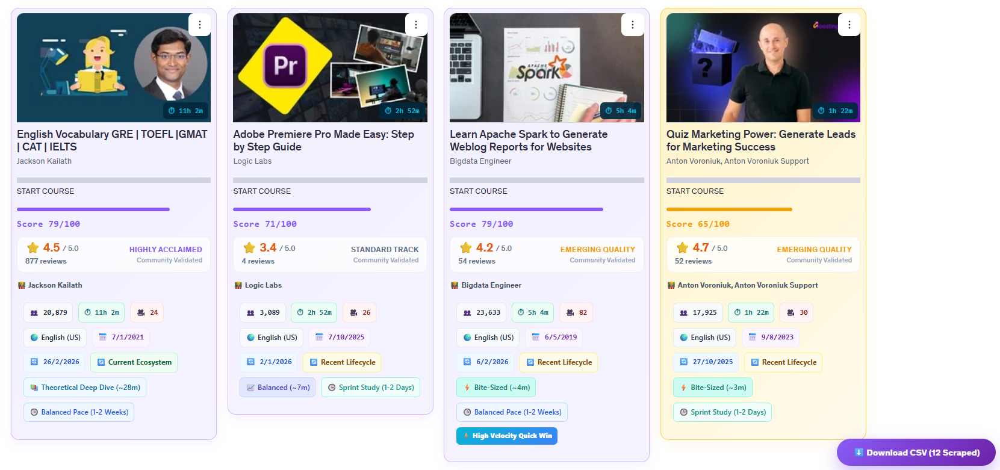

# Udemy - Enhanced My Learning Screen

An advanced browser extension that turns your Udemy learning experience into a metrics-driven dashboard. It injects course analytics, efficiency scoring, category metadata, export tools, and badge-based insights directly into Udemy pages.



---

## 🚀 Current Project Features

- **Real-time course analytics:** Injects score badges and metadata directly into Udemy course cards.
- **AI Efficiency Score:** Computes a composite score from rating credibility, enrollment strength, pacing, freshness, and course structure.
- **Category/Sub-category export:** Captures Udemy taxonomy and includes it in CSV output for organized filtering.
- **CSV export engine:** Downloads course data as UTF-8/BOM-compatible CSV for Excel and spreadsheet applications.
- **Local browser caching:** Persists course records in `localStorage` to speed reloads and reduce repeat API calls.
- **Practice exam adaptation:** Keeps scoring meaningful for non-video quiz/exam course types.
- **Visual badge system:** Displays runtime, lecture count, language, freshness, commitment level, and marketplace ribbons.
- **Cross-browser source layout:** Supports Chrome/Edge with `src/manifest.json` and Firefox with `src/manifest_firefox.json`.
- **Internationalization:** Includes language support in `_locales/*/messages.json` for English, German, Spanish, French, Italian, and Japanese.

---

## 🎨 Color Tiers & Background Styling Matrix

The dashboard elements adapt their themes dynamically according to the calculated scores:

| Score Range | Trust Tier Label | Color Palette | Card Visual Presentation Style |
| :--- | :--- | :--- | :--- |
| **85 - 100** | `Elite Rank Class` | `#06b6d4` (Cyan) | Premium Mint/Cyan gradient background, high prominence cyan borders. |
| **70 - 84** | `Highly Acclaimed` | `#8b5cf6` (Violet) | Soft Lavender gradient theme with subtle violet accent borders. |
| **50 - 69** | `Good Standing` | `#f59e0b` (Amber) | Alert Warm Amber wash backdrop with gold outlines. |
| **0 - 49** | `Deprioritized` | `#ef4444` (Red) | High-warning crimson wash with prominent warning borders. |

---

## 🧠 How the Score Engine Works

This extension uses a multi-factor scoring algorithm to rank Udemy courses with more context than star-only ratings.

### 1) Rating Credibility (Max 35 Points)

The score engine applies Bayesian-style weighting to combine raw ratings with review volume.

- More reviews increase credibility.
- Low-review courses are buffered by a sigmoid credibility curve.
- This prevents a single 5-star review from outranking a widely-reviewed high-quality course.

### 2) Enrollment & Engagement (Max 25 Points)

This dimension rewards social proof and activity.

- Enrollment volume is scaled logarithmically so large audiences contribute meaningfully without dominating the score.
- A review-to-enrollment ratio provides an engagement bonus.
- Courses with strong participation score higher.

### 3) Efficiency & Structure (Max 25 Points)

This evaluates course digestibility and pace.

- Duration and lecture count are combined to compute average lecture length.
- Ideal lecture lengths fall in the 3–10 minute range.
- Courses with overly long single lectures or fragmented structure receive a structural penalty.

### 4) Freshness & Relevance (Max 15 Points)

The engine applies a smooth decay curve to reward recently updated content.

- Newly refreshed courses earn higher freshness points.
- Older content decays gradually instead of receiving a harsh penalty.
- This highlights units that are more likely to contain current information.

### Practice Exam Normalization

For quiz and exam-style content with little or no runtime, the score engine switches to a normalized evaluation mode so the course still receives a meaningful rank.

---

## 📊 CSV Export: Category and Sub-category Position
When clicking the floating interaction button, the utility processes all cached application records from your browser and transforms them into a structured file output. 


The generated CSV includes the new taxonomy fields in this order:

`Course ID`, `Course Name`, `Instructor`, `AI Efficiency Score`, `Rating`, `Reviews Count`, `Enrolled Students`, `Duration (Hours)`, `Lectures Count`, `Language`, `Created Date`, `Updated Date`, `Freshness Status`, `Pacing Model`, `Commitment Level`, `AI Recommendation`, `Is Practice Test`, **`Category`**, **`Sub-category`**, `Details URL`


---

## 🛠️ How to Use Locally

Load the extension locally from the `src/` folder in browser developer mode.

### 1) Clone the repository

Open a terminal and run:

```bash
git clone https://github.com/your-username/udemy-improved-course-library.git
cd udemy-improved-course-library
```

### 2) Load in Chrome or Edge

1. Open `chrome://extensions/` in Chrome or `edge://extensions/` in Edge.
2. Enable **Developer mode** in the top-right.
3. Click **Load unpacked**.
4. Select the `src/` folder from the cloned repository.
5. Confirm the extension appears in the list and is enabled.
6. Open Udemy and visit your learning dashboard or course listing page.

> Tip: Select the `src/` folder, not the repository root.

### 3) Load in Firefox

1. Open Firefox and go to `about:debugging#/runtime/this-firefox`.
2. Click **Load Temporary Add-on**.
3. Choose `src/manifest_firefox.json` from the cloned repository.
4. Confirm Firefox shows the temporary add-on.
5. Visit Udemy and verify the injected dashboard details.

### 4) Verify the extension

- Confirm badges and score panels appear on Udemy course cards.
- Confirm the floating export button appears after course data is collected.
- Use the browser console to inspect `src/script.js` logs if needed.

---

## 📌 Notes

- Use `src/manifest.json` for Chrome/Edge.
- Use `src/manifest_firefox.json` for Firefox.
- Cached course records are stored under `localStorage.udemyCourseDB`.
- After editing code, refresh the extension and reload the Udemy page.


